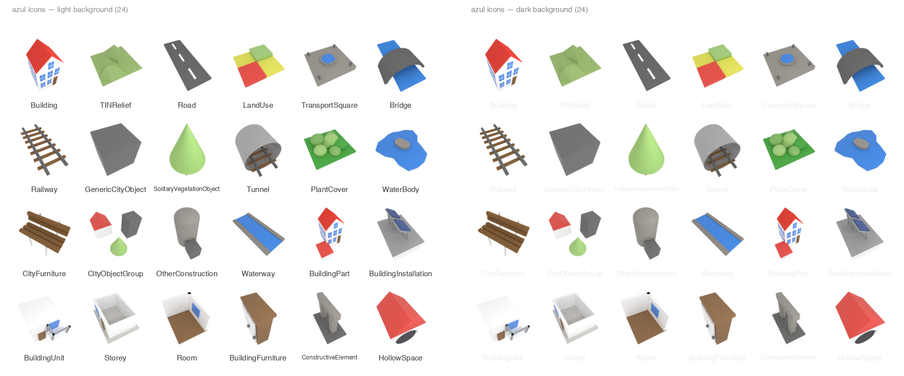

# azulicons

Icons for [azul](https://github.com/tudelft3d/azul), an open-source 3D city
model viewer built at TU Delft. This repository holds the Xcode asset catalog
that azul displays for CityGML/CityJSON object types, together with the
Blender sources that reproduce every icon pixel-for-pixel.



The set covers the sixteen independent object types — `Building`,
`TINRelief`, `Road`, `LandUse`, `TransportSquare`, `Bridge`, `Railway`,
`GenericCityObject`, `SolitaryVegetationObject`, `Tunnel`, `PlantCover`,
`WaterBody`, `CityFurniture`, `CityObjectGroup`, `OtherConstruction` and
`Waterway` — plus the eight building sub-types `BuildingPart`,
`BuildingInstallation`, `BuildingUnit`, `Storey`, `Room`,
`BuildingFurniture`, `ConstructiveElement` and `HollowSpace`. Each icon is a
small 3D diorama rendered with one shared lighting rig, so the set is
uniformly lit and framed; the building sub-types echo the Building icon's
palette (white walls, red roof, brown door, blue glass).

## Layout

| Path | Contents |
| ---- | -------- |
| `Assets.xcassets/` | The asset catalog: one imageset per icon with real 64/128/192 px renders in the 1x/2x/3x slots, plus the macOS/iOS app icon. |
| `blend/<Icon>.blend` | Self-contained Blender source per icon (geometry, camera, light, world, render settings). Twenty-four files, named after their imagesets. |
| `blend/README.md` | The shared lighting rig, per-icon design notes, and historical fitting values. |
| `azul logo.blend` | The 2016 logo source; the Building icon geometry derives from it. |
| `tools/make_preview.py` | Regenerates `preview.png` from the catalog (requires Pillow). |
| `AGENTS.md` | Repository guide: verification workflow, conventions, and Blender gotchas. |

## Rendering an icon

Open `blend/<Icon>.blend` in Blender and press Render (F12), or:

```
/Applications/Blender.app/Contents/MacOS/Blender --background blend/<Icon>.blend \
  --python-expr "import bpy; bpy.ops.render.render(write_still=True)"
```

Renders are written next to the `.blend`. Settings live in each file: Cycles,
512 samples, transparent film, Standard view transform, RGBA PNG. For the
three catalog sizes, render at 64/128/192 px and copy the results into the
imageset. Icons must keep the normalized framing described in `AGENTS.md`:
the rendered alpha bbox spans 84 % of the canvas (±1 px) and is centred.

To regenerate the preview sheet after changing icons:

```
python3 tools/make_preview.py
```

## Using the icons in azul

azul looks icons up by the exact object type string
(`UIImage(named: typeName)`), so imageset folder names are the type names
verbatim. To update azul, copy the imageset folders into azul's
`src/Assets.xcassets/`; Xcode picks up new imagesets without project changes.

## Licence

azulicons is part of the azul project and is available under the
[GPLv3](https://www.gnu.org/licenses/gpl-3.0.en.html) licence, like azul
itself.
